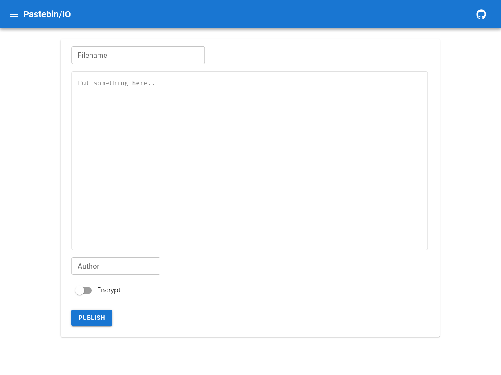
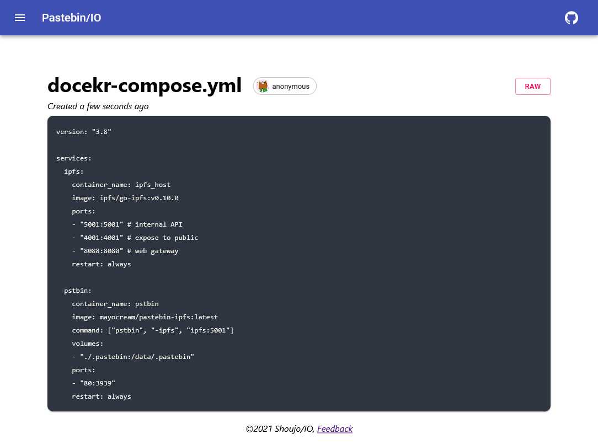

# pastebin-ipfs


[简体中文](./README.zh.md)

<small>_(IPFS Archivists)_</small>    

*Still in development, Pull Requests are welcomed.*

Pastebin built on IPFS, securely served by Distributed Web and Edge Network.

It's like [gist](https://gist.github.com/) but for anonymous.
Alternative to [Ubuntu Pastebin](https://paste.ubuntu.com/).

[paste.shoujo.io](https://paste.shoujo.io)

<table>
  <td></td>
  <td></td>
</table>
         
## Features

<!-- - [Gallery](https://paste.shoujo.io/gallery) shows *Public* snippets -->
- Stored in [IPFS](https://ipfs.io/) distributed network
- *AES-GCM* Encryption
- OpenAPI (CORS Origin `*`)
- File upload (API Only)
- Cache by CDN (or [IPFS Gateway](https://cloudflare-ipfs.com))
- Syntax highlight by [Prismjs](https://github.com/PrismJS/prism)
- Markdown Preview
- No Expiration

## Usage

### Web

Webpage serves [Gallery](https://paste.shoujo.io/gallery) and provide GUI to paste your snippets.

Vist [Webpage](https://paste.shoujo.io).

### API

**API Docs**: [*OpenAPI v3 - Swagger UI*](https://mayocream.github.io/pastebin-ipfs/api/)    

Pastebin it has a rate limit at 20 qps.  

### Terminal

Create snippets:

```bash
$ curl -T doc.md https://paste.shoujo.io/api/v0/ # remember to have a slash '/' at the end
# or
$ curl -X POST https://paste.shoujo.io/api/v0/ -d 'いつか君に伝えたいと思っていた気持ちは'
# or
$ curl -X PUT https://paste.shoujo.io/api/v0//lyrics.txt -d 'Stars fall, birds sleep'
```

Cat snippets:

```bash
curl https://paste.shoujo.io/api/v0/QmTnhJH8azDsudkxgp8wNLEN5Zq86NAE6DAkzwGBDpaQ6Z/plain.txt
```

## Self-Hosted

### Kubernetes

Deploy pastebin-ipfs with [Helm](https://helm.sh/).

```bash
git clone https://github.com/mayocream/pastebin-ipfs
cd pastebin-ipfs/helm
helm install pastebin-ipfs .
```

Refer [values.yaml](./helm/values.yaml) for more detail.

### Docker Compose

Edit [deploy/docker/docker-compose.yml](https://github.com/mayocream/pastebin-ipfs/blob/main/deploy/docker/docker-compose.yml) file.

```bash
docker-compose up -d
```

### Docker

You must have ipfs-daemon running on your host first.

Check out IPFS [docker-compose.yml](https://github.com/mayocream/pastebin-ipfs/blob/main/docker-compose.yml).

```bash
docker run -p 8080:3939 mayocream/pastebin-ipfs:latest
```

## Development

```bash
make run # start ipfs daemon at http://127.0.0.1:5001
         # run pastebin API at http://127.0.0.1:3939
make web-live # run Webpage
```

## Feedback

You can provide suggestion or ask question by open a Github Issue in any languages. 🧐

## Todo

- [ ] replace ipfs daemon with [ipfs-lite](github.com/hsanjuan/ipfs-lite).

## Credits

- [Web Crypto Encryption and Decryption Example](https://github.com/bradyjoslin/webcrypto-example)

## LICENSE

MIT
